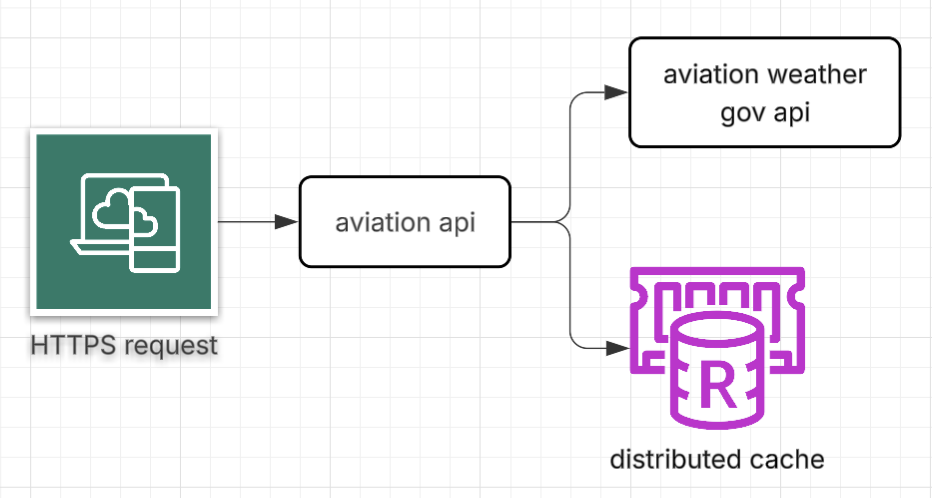

# Aviation-API
This API is a wrapper for ICAO API, providing endpoints to fetch navigational data for ICAO code lookups.

## API Specification
The endpoints supported by aviation-api are available in the openapi.yaml file.
The endpoints supported by aviation-api are documented in swagger.yaml, which can be accessed at `http://localhost:8080/api/swagger-ui.html` when the application is running. The API supports the following endpoints:

## Running the Application

### Prerequisites
- Docker and Docker Compose installed

### Quick Start with Docker Compose

The simplest way to run the application is using Docker Compose, which orchestrates both the Spring Boot API and Redis cache:

```bash
# Navigate to project directory
cd /Users/pessoal/IdeaProjects/aviation-api

# Build and start all services
docker compose up

# The API will be available at: http://localhost:8080/api/swagger-ui.html
```

### Stopping the Application
```bash
# Stop all services
docker compose down

# Stop and remove volumes
docker compose down -v
```

### Building Only the Docker Image

If you prefer to build just the Docker image without starting services:

```bash
# Build the image
docker build -t aviation-api:latest .

# Run the container (requires Redis running separately)
docker run -p 8080:8080 \
  -e SPRING_DATA_REDIS_HOST=host.docker.internal \
  -e SPRING_DATA_REDIS_PORT=6379 \
  aviation-api:latest
```

### Local Development (without Docker)

For local development, you can run the application directly:

```bash
# Build the project
./gradlew build

# Run the application
./gradlew bootRun
```

Ensure Redis is running on `localhost:6379`.

## Environment Variables

The following environment variables can be configured:

| Variable | Default | Description |
|----------|---------|-------------|
| `SPRING_DATA_REDIS_HOST` | localhost | Redis host |
| `SPRING_DATA_REDIS_PORT` | 6379 | Redis port |
| `LOGGING_LEVEL_COM_AVIATION_API` | DEBUG | Logging level |

## Rate Limiting Configuration

The rate limiter is configured via `application.yaml`:

```yaml
aviation:
  weather:
    api:
      max-requests: 80        # Maximum requests allowed
      window-seconds: 60      # Time window in seconds
```

## Retry Configuration

The application implements exponential backoff retry logic for resilient API calls. Configure retries in `application.yaml`:

```yaml
aviation:
  weather:
    api:
      max-attempts: 3           # Number of retry attempts (1 = no retries, default = 3)
      initial-interval: 1000    # Initial backoff interval in milliseconds (default = 1000)
      multiplier: 1.5           # Exponential backoff multiplier (default = 1.5)
      max-interval: 10000       # Maximum backoff interval in milliseconds (default = 10000)
```

### Retry Behavior

The retry mechanism uses **exponential backoff** to handle transient failures:

1. **First attempt**: Immediate
2. **Second attempt**: Wait `initial-interval` ms (1000ms default)
3. **Third attempt**: Wait `initial-interval × multiplier` ms (1500ms default)
4. **Subsequent attempts**: Backoff continues up to `max-interval` ms

**Example with default settings:**
- Attempt 1 (immediate) → fails
- Attempt 2 (wait 1s) → fails
- Attempt 3 (wait 1.5s) → succeeds ✓

Retries are attempted for transient failures like:
- Network timeouts
- Temporary service unavailability
- Connection resets

Non-recoverable errors (e.g., 4xx HTTP status codes) are not retried.

## Architecture
The application is designed to scale and be resilient, while integrating with downstream services that require throttling.
In order to respect rate limits without impacting scalability, the application uses distributed cache.



## Further Improvements to Make it Production-Ready
- Ensure only reasonable recoverable exceptions are retried
- Improve code coverage including end-to-end tests validating retry and rate limiting behavior
- Implement circuit breaker pattern for downstream service calls
- Add monitoring and alerting for rate limit breaches and retry failures
- Receive and propagate correlation IDs for better traceability across services